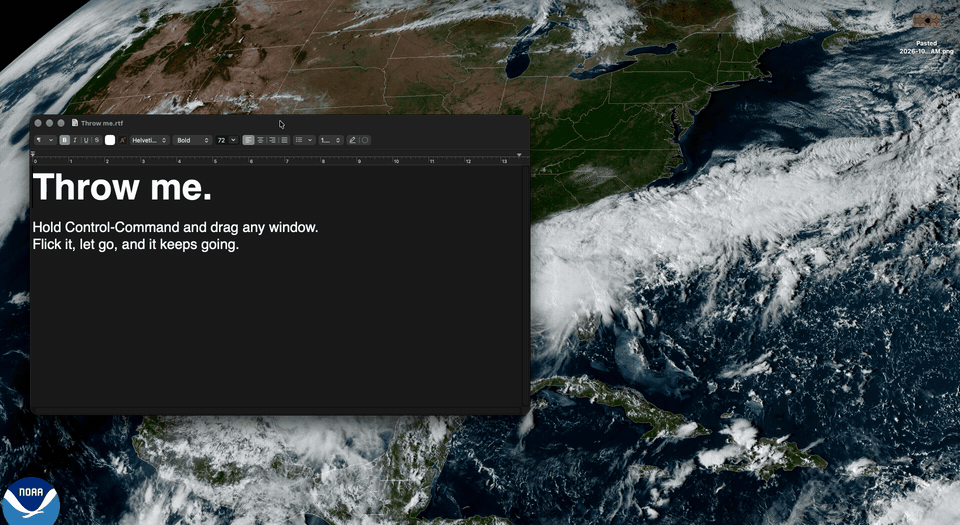

# Inertia

Throw your Mac's windows around. Hold ⌃⌘, drag any window, flick it, and let go. It keeps its size,
coasts with momentum, and bounces off the screen edges.



Bigger windows carry more inertia, so they glide farther and take a firmer flick to get moving. You
can tune the feel from the menu bar, and a live preview shows what each slider does as you drag it.

Inertia sits next to window managers like Rectangle or Loop rather than replacing them.

## Requirements

- macOS 15 or later
- Apple Silicon

## Install

1. Download `Inertia.zip` from the [latest release](https://github.com/7thfrontier/inertia/releases/latest)
   and unzip it.
2. Move `Inertia.app` to your Applications folder.
3. The app isn't notarized yet, so macOS will refuse to open it the first time. Clear the download
   flag in Terminal:

   ```sh
   xattr -dr com.apple.quarantine /Applications/Inertia.app
   ```

   Or try to open it once, then go to System Settings > Privacy & Security and click **Open Anyway**.
4. Open Inertia. macOS asks for **Accessibility** access, which any app that moves other apps'
   windows needs. Turn on the switch next to Inertia in System Settings > Privacy & Security >
   Accessibility.

To start it automatically, turn on **Open at Login** in the menu-bar panel.

## Use

- **Throw:** hold ⌃⌘, drag a window, and release while it's still moving. A gentle release just
  moves the window.
- **Catch:** click anywhere while a window is coasting to stop it.
- **Change the shortcut:** pick another combination under Activation, or choose Custom… and press
  the modifier keys you want.

Settings in the panel:

| Setting | What it does |
|---|---|
| Launch Gain | How hard your flick launches the window |
| Glide Time | How long it keeps gliding before friction stops it |
| Restitution | How much it rebounds off a screen edge |
| Mass by Area | Bigger windows glide farther and resist starting |
| Advanced > Minimum Release Speed | How firm a flick must be to count as a throw |
| Advanced > Rest Speed | How slow a window must get before it settles |
| Advanced > Labels | Show the controls as words or as physics symbols |

The reset button in the footer restores the defaults.

Fullscreen windows can't be moved, and Inertia leaves those clicks alone. Inertia makes no
network connections.

## Uninstall

Quit Inertia from its panel (the power button), drag it from Applications to the Trash, and remove
it from System Settings > Privacy & Security > Accessibility.

## Build from source

Needs the Xcode command line tools (`xcode-select --install`). No Xcode project.

```sh
./build.sh
open Inertia.app
```

`build.sh` compiles `main.swift`, ad-hoc signs the app, runs the self-test (`Inertia --selftest`,
which covers the physics, shortcut handling, and the panel), and writes `Inertia.zip` for releases.
A failing self-test fails the build.

`scripts/reset-first-run.sh` replays the first-run flow while you work on it.

`art/makeicons.swift` regenerates `Inertia.icns`.

## License

MIT. See [LICENSE](LICENSE).
